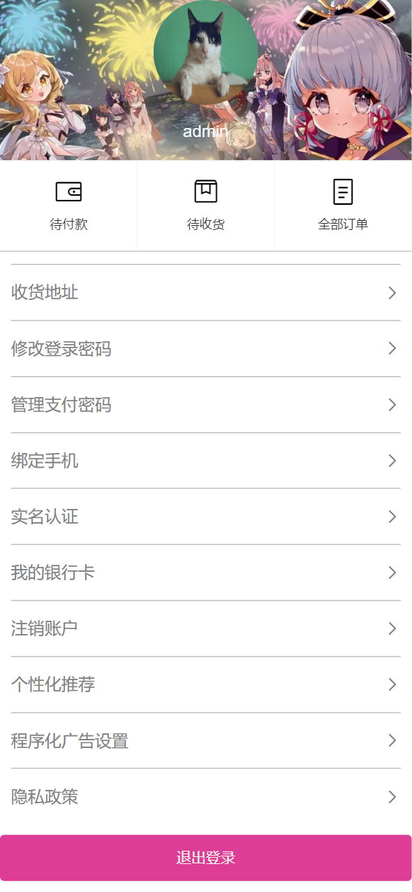
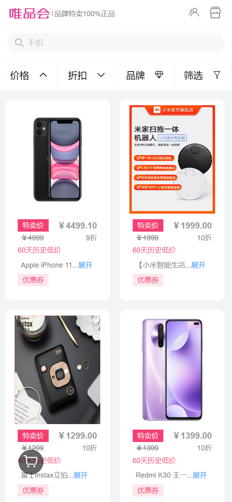
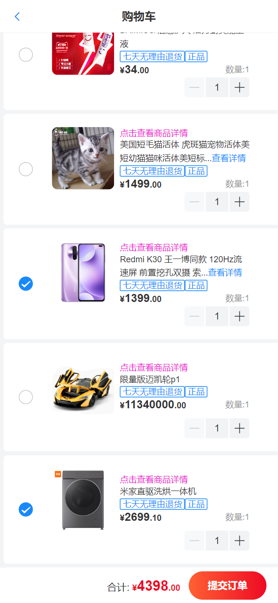
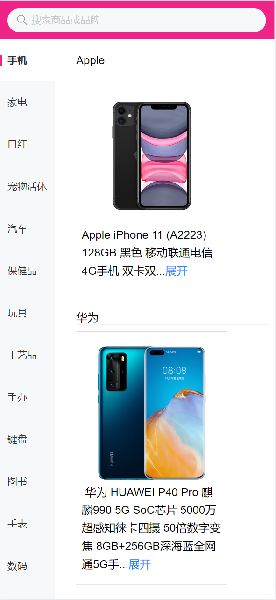

# 移动端练习项目说明文档

### 目录

[TOC]

------

### 版本说明

当前版本：V1.0

| 版本号 | 更新时间   | 更新说明                                           |
| ------ | ---------- | -------------------------------------------------- |
| V1.0   | 2023-06-10 | 移动端练习项目之唯品会 |

-----

### 选题

唯品会

### 服务器接口以及初始账号说明

1. 服务器接口地址: http://121.89.205.189:3000/apidoc
2. 默认登录账号信息: admin  默认密码: 123456

### 项目实施计划以及完成进度

##### 第一天

  1. 分析唯品会项目网站和后端接口;
  2. `Vue` 路由组件\样式组件等依赖初始化;
  3. `axios` 请求模式代码封装;
  4. 全局引入 `UI` 组件库, 初始化样式并封装「页面头部」组件;
  5. 服务器请求接口配置和前端路由配置。

##### 第二天

  1. 渲染「个人中心」和「登录」 页面;
  2. 实现「验证码登录」「密码登录」和「退出登录」功能;
  3. 使用 `TypeScript` 对请求模式进行增强。

##### 第三天

 1. 设计并实现移动端 `rem` 布局;
 2. 渲染「首页」和「搜索页」;
 3. 设计并实现搜索功能。

##### 第四天

 1. 渲染「列表页」和「详情页」。

##### 第五天

 1. 渲染「购物车页」和「分类页」;
 2. 设计并完成 UI 交互逻辑。

### 项目完成效果图

1. 登录

2. 个人中心

3. 首页

4. 搜索页

5. 列表页

6. 详情页

7. 购物车页

8. 分类页

